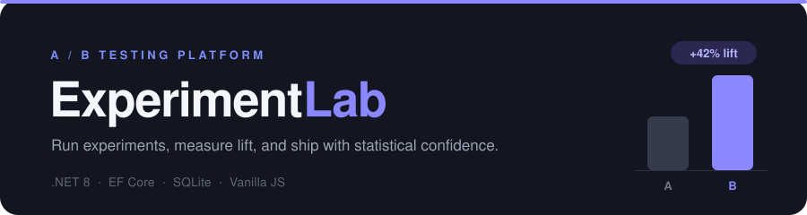

<p align="center">
  
</p>

<p align="center">
  
  
  
  
  
</p>

<p align="center">
  <b>An end-to-end A/B testing &amp; experimentation platform</b> — define experiments, split traffic,
  collect events, run the statistics, and get a plain-English ship decision.
</p>


---

## What it is

ExperimentLab is the kind of internal tool a product team builds for itself: a service that **runs controlled experiments and decides what to ship**. It deterministically assigns users to variants, records what they do, and applies a proper two-proportion z-test to answer the only question that matters — *did the change actually work, or is the difference just noise?*

The data is **real because the platform generates it**, not because it was downloaded. A built-in traffic simulator drives thousands of users through the live assignment and event endpoints, so every number on the dashboard is the genuine output of the system's own pipeline.

<p align="center">
  
</p>

---

## Features

- **Experiment management** — create experiments with weighted variants, with validation (traffic must sum to 100, variant names unique), and `draft → running → stopped` lifecycle control.
- **Deterministic assignment engine** — a SHA-256 hash of `experimentId:userId` maps each user to a stable bucket, so the same user always lands in the same variant. Mixing in the experiment id de-correlates assignments across experiments.
- **Event collection** — an append-only events table records exposures and conversions, the raw telemetry every analysis is built on.
- **Traffic simulator** — generates realistic experiment data on demand, with `treatment` converting at a genuinely higher rate so there is a true effect to detect.
- **Statistics engine** — two-proportion z-test with p-value, observed lift (absolute and relative), and a 95% confidence interval on the difference.
- **Decision layer** — turns the raw statistics into a verdict a non-statistician can act on: `SHIP`, `HOLD`, `NO_DIFFERENCE`, or `KEEP_RUNNING`.
- **Dashboard** — a single-page, framework-free frontend that renders the verdict, a control-vs-treatment head-to-head, and the supporting stats, served by the same app.

---

## How it works

```
 Visitor ──▶ Assignment ──▶ Events ──▶ Statistics ──▶ Decision ──▶ Dashboard
            (hash → bucket) (exposure/  (z-test, CI)  (ship / hold)  (verdict +
                            conversion)                              head-to-head)
            └──────────────── ASP.NET Core · EF Core · SQLite ───────────────┘
```

A request flows **controller → DbContext → SQLite → DTO → response**; every capability is one more endpoint on that same backbone.

---

## Quick start

You only need the **.NET 8 SDK**. SQLite needs no install — EF Core bundles it and creates the database file automatically.

```bash
# 1. verify the SDK
dotnet --version          # should print 8.x.x

# 2. from the project folder
dotnet restore            # first time only
dotnet run
```

Then open:

- **http://localhost:5080/** — the dashboard
- **http://localhost:5080/swagger** — the interactive API explorer

### See a result in 60 seconds

In Swagger (or with `curl`):

```bash
# create an experiment
curl -X POST http://localhost:5080/api/experiments -H "Content-Type: application/json" -d '{
  "name": "Button color test",
  "description": "Blue vs green signup button",
  "variants": [
    { "name": "control",   "trafficPercentage": 50 },
    { "name": "treatment", "trafficPercentage": 50 }
  ]
}'

curl -X POST http://localhost:5080/api/experiments/1/start
curl -X POST "http://localhost:5080/api/experiments/1/simulate?users=5000"
```

Now open the dashboard — you'll see a **SHIP** verdict with treatment beating control.

---

## API reference

| Method | Route | Description |
|---|---|---|
| `GET` | `/api/experiments` | List all experiments with variants |
| `GET` | `/api/experiments/{id}` | Get one experiment |
| `POST` | `/api/experiments` | Create an experiment + variants |
| `POST` | `/api/experiments/{id}/start` | Set status → `running` |
| `POST` | `/api/experiments/{id}/stop` | Set status → `stopped` |
| `DELETE` | `/api/experiments/{id}` | Delete an experiment (variants cascade) |
| `GET` | `/api/experiments/{id}/assign?userId=` | Deterministically assign a user to a variant |
| `POST` | `/api/events` | Record an event (`exposure` / `conversion`) |
| `GET` | `/api/events/{experimentId}` | Recent events for an experiment |
| `POST` | `/api/experiments/{id}/simulate?users=` | Generate simulated traffic + events |
| `GET` | `/api/experiments/{id}/results` | Full statistics + verdict |

Sample `results` response:

```json
{
  "control":   { "exposures": 2510, "conversions": 255, "rate": 0.1016 },
  "treatment": { "exposures": 2491, "conversions": 360, "rate": 0.1445 },
  "relativeLift": 0.4225,
  "pValue": 0.0000,
  "confidenceInterval95": { "lower": 0.0248, "upper": 0.0611 },
  "significant": true,
  "decision": { "verdict": "SHIP", "reason": "Ship treatment — 42% relative lift, p < 0.001." }
}
```

---

## Statistics, honestly

For binary conversion data the correct test is a **two-proportion z-test**, not a t-test. The engine uses a **pooled** standard error for the significance test (under the null of no difference, how surprising is this gap?) and an **unpooled** standard error for the confidence interval on the true difference. The z-score is converted to a p-value with the Abramowitz & Stegun normal-CDF approximation, since .NET ships no built-in normal distribution.

The decision layer then walks three gates in order, because a p-value alone is not a decision:

1. **Enough data?** — refuse to declare a result before each arm reaches a minimum sample. This guards against *peeking*, the classic mistake of stopping the moment a result looks significant, which inflates false positives.
2. **Statistically significant?** — `p < 0.05`, otherwise keep the control.
3. **Practically meaningful?** — the lift must clear a minimum threshold worth shipping for; a significant-but-trivial result is held, not shipped.

> A reported `p` of `0` is rounding, never a literal zero — no result is impossible under the null. The verdict text reports `p < 0.001` for exactly this reason.

---

## Project structure

```
ExperimentLab/
├── Program.cs                      # entry point: EF, controllers, static files, Swagger
├── ExperimentLab.csproj
├── appsettings.json                # SQLite connection string
├── Models/
│   ├── Experiment.cs               # entities → tables
│   ├── Variant.cs
│   └── Event.cs
├── Data/
│   └── AppDbContext.cs             # EF Core context + one-to-many config
├── Dtos/
│   ├── ExperimentDtos.cs           # request/response shapes
│   └── EventDtos.cs
├── Services/
│   ├── AssignmentService.cs        # deterministic hash → variant
│   ├── StatsService.cs             # two-proportion z-test, CI
│   └── DecisionService.cs          # verdict gates
├── Controllers/
│   ├── ExperimentsController.cs    # CRUD, lifecycle, assign, simulate
│   ├── EventsController.cs         # record/query events
│   └── ResultsController.cs        # stats + decision
├── wwwroot/
│   └── index.html                  # the dashboard (HTML/CSS/JS)
└── assets/
    ├── banner.svg
    └── frontend.png
```

---

## Tech stack

| Layer | Choice |
|---|---|
| Runtime | .NET 8 / ASP.NET Core Web API |
| Persistence | Entity Framework Core + SQLite (single-file, zero-setup) |
| Statistics | Two-proportion z-test, bootstrap-free analytic CI, normal-CDF approximation |
| Frontend | Vanilla HTML / CSS / JavaScript — no framework, served from `wwwroot` |
| API docs | Swagger / OpenAPI |

---

## Roadmap

- [x] **Phase 1** — experiments & variants (API + database)
- [x] **Phase 2** — deterministic assignment engine
- [x] **Phase 3** — event collection + traffic simulator
- [x] **Phase 4** — statistics engine (z-test, CI, lift)
- [x] **Phase 5** — decision layer (verdict gates)
- [x] **Phase 6** — dashboard
- [ ] EF migrations (replace `EnsureCreated` for schema evolution without data loss)
- [ ] Multi-variant tests + guardrail metrics
- [ ] Cloud deployment + self-contained `.exe` publish

---

## Troubleshooting

- **`dotnet: command not found`** — the SDK isn't on your PATH. Reinstall .NET 8 and reopen your terminal.
- **Port already in use** — change `5080` in `Properties/launchSettings.json`.
- **`no such table: Events` after adding a model** — `EnsureCreated()` only builds the schema when the database doesn't exist yet. Stop the app, delete `experimentlab.db`, `experimentlab.db-shm`, and `experimentlab.db-wal`, then run again. (EF migrations are the long-term fix — see roadmap.)
- **`results` says it needs `control` and `treatment`** — the built-in test compares two arms named exactly `control` and `treatment`.
- **Reset all data** — stop the app and delete the three `experimentlab.db*` files; they're recreated on next run.

---

## Author

**Ailya Shah** — Data Science, SEECS.

Repository owner & author. 

---

## License

MIT — free to use, learn from, and build on.
