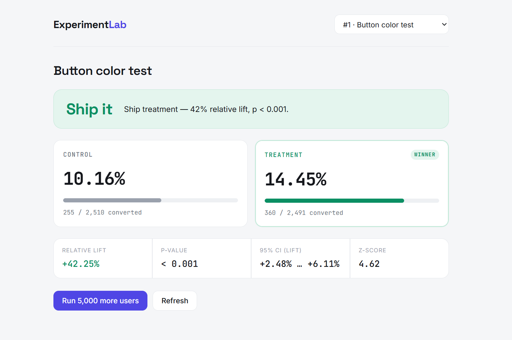

<p align="center">
  
</p>

<p align="center">
  
  
  
  
  
  
</p>

<p align="center">
  <b>An end-to-end A/B testing &amp; experimentation platform</b> — define experiments, split traffic,
  collect events, run the statistics, and get a plain-English ship decision.
</p>

<p align="center">
  Built by <b>Ailya Shah</b> &middot; Data Science, SEECS
</p>

---

## What it is

ExperimentLab is the kind of internal tool a product team builds for itself: a service that **runs controlled experiments and decides what to ship**. It deterministically assigns users to variants, records what they do, and applies a proper two-proportion z-test to answer the only question that matters — *did the change actually work, or is the difference just noise?*

It supports **any number of variants with any names** — the control is a designated flag (`isControl`), not a hardcoded label, so the same engine handles a simple A/B test or a five-arm test with equal ease.

The data is **real because the platform generates it**, not because it was downloaded. An optional, explicitly-gated traffic simulator drives thousands of users through the live assignment and event endpoints, so every number on the dashboard is the genuine output of the system's own pipeline — never fabricated in a real deployment.

<p align="center">
  
</p>

---

## Features

- **Experiment management** — create experiments with weighted variants, with validation (traffic must sum to 100, variant names unique, exactly one designated control), and `draft → running → stopped` lifecycle control.
- **Deterministic assignment engine** — a SHA-256 hash of `experimentId:userId` maps each user to a stable bucket, so the same user always lands in the same variant. Mixing in the experiment id de-correlates assignments across experiments.
- **Event collection** — an append-only events table records exposures and conversions, the raw telemetry every analysis is built on.
- **Traffic simulator (gated)** — generates realistic experiment data on demand, with non-control arms converting at a genuinely higher rate so there's a true effect to detect. Disabled by default; only runs when `Demo:SeedingEnabled` is explicitly `true`, so a real deployment can never have its data silently polluted by a demo click.
- **Statistics engine** — two-proportion z-test comparing the control against *every* other arm: p-value, observed lift (absolute and relative), and a 95% confidence interval on the difference.
- **Decision layer** — turns the raw statistics into a verdict a non-statistician can act on: `SHIP`, `HOLD`, `NO_DIFFERENCE`, or `KEEP_RUNNING`.
- **Dashboard** — a single-page, framework-free frontend that renders the verdict, a control-vs-arm head-to-head for every variant, and the supporting stats, served by the same app.
- **Schema migrations** — EF Core migrations track every schema change; the database upgrades in place and existing data is never wiped.
- **Single-file deployment** — publishes to one self-contained `.exe`. No .NET install required to run it.

---

## How it works

```
 Visitor ──▶ Assignment ──▶ Events ──▶ Statistics ──▶ Decision ──▶ Dashboard
            (hash → bucket) (exposure/  (z-test, CI)  (ship / hold)  (verdict +
                            conversion)   per arm                    head-to-head)
            └──────────────── ASP.NET Core · EF Core · SQLite ───────────────┘
```

A request flows **controller → DbContext → SQLite → DTO → response**; every capability is one more endpoint on that same backbone.

---

## Quick start (run from source)

You only need the **.NET 8 SDK**. SQLite needs no install — EF Core bundles it.

```bash
# 1. verify the SDK
dotnet --version          # should print 8.x.x

# 2. apply the database schema (first time only)
dotnet tool install --global dotnet-ef     # one-time, if not already installed
dotnet ef database update

# 3. run it
dotnet run
```

Then open:

- **http://localhost:5080/** — the dashboard
- **http://localhost:5080/swagger** — the interactive API explorer

### Run the published exe instead

No SDK, no install — see [Single-file deployment](#single-file-deployment) below.

### See a result in 60 seconds

In Swagger (or with `curl`) — note the **`isControl`** flag, which is required on exactly one variant:

```bash
curl -X POST http://localhost:5080/api/experiments -H "Content-Type: application/json" -d '{
  "name": "Button color test",
  "description": "Blue vs green signup button",
  "variants": [
    { "name": "control",   "trafficPercentage": 50, "isControl": true },
    { "name": "treatment", "trafficPercentage": 50 }
  ]
}'

curl -X POST http://localhost:5080/api/experiments/1/start
curl -X POST "http://localhost:5080/api/experiments/1/simulate?users=5000"
```

(The simulate call only works if `Demo:SeedingEnabled` is `true` in your config — true by default in `appsettings.Development.json`, false in production. See [Demo data seeding](#demo-data-seeding).)

Now open the dashboard — you'll see a **SHIP** verdict with treatment beating control.

---

## API reference

| Method | Route | Description |
|---|---|---|
| `GET` | `/api/experiments` | List all experiments with variants |
| `GET` | `/api/experiments/{id}` | Get one experiment |
| `POST` | `/api/experiments` | Create an experiment + variants (exactly one `isControl: true`) |
| `POST` | `/api/experiments/{id}/start` | Set status → `running` |
| `POST` | `/api/experiments/{id}/stop` | Set status → `stopped` |
| `DELETE` | `/api/experiments/{id}` | Delete an experiment (variants cascade) |
| `GET` | `/api/experiments/{id}/assign?userId=` | Deterministically assign a user to a variant |
| `POST` | `/api/events` | Record an event (`exposure` / `conversion`) |
| `GET` | `/api/events/{experimentId}` | Recent events for an experiment |
| `POST` | `/api/experiments/{id}/simulate?users=` | Generate simulated traffic — **gated**, see below |
| `GET` | `/api/experiments/{id}/results` | Control vs. every other arm: statistics + verdict |

Sample `results` response — `control` is the designated baseline, `comparisons` holds one entry per other arm (any number, any names):

```json
{
  "experimentId": 1,
  "experimentName": "Button color test",
  "control": { "name": "control", "exposures": 2510, "conversions": 255, "rate": 0.1016 },
  "comparisons": [
    {
      "variant": "treatment",
      "exposures": 2491, "conversions": 360, "rate": 0.1445,
      "relativeLift": 0.4225,
      "pValue": 0.0000,
      "confidenceInterval95": { "lower": 0.0248, "upper": 0.0611 },
      "significant": true,
      "decision": { "verdict": "SHIP", "reason": "Ship treatment — 42% relative lift, p < 0.001." }
    }
  ]
}
```

---

## Statistics, honestly

For binary conversion data the correct test is a **two-proportion z-test**, not a t-test. The engine uses a **pooled** standard error for the significance test (under the null of no difference, how surprising is this gap?) and an **unpooled** standard error for the confidence interval on the true difference. The z-score is converted to a p-value with the Abramowitz & Stegun normal-CDF approximation, since .NET ships no built-in normal distribution.

The decision layer then walks three gates in order, because a p-value alone is not a decision:

1. **Enough data?** — refuse to declare a result before each arm reaches a minimum sample. This guards against *peeking*, the classic mistake of stopping the moment a result looks significant, which inflates false positives.
2. **Statistically significant?** — `p < 0.05`, otherwise keep the control.
3. **Practically meaningful?** — the lift must clear a minimum threshold worth shipping for; a significant-but-trivial result is held, not shipped.

> A reported `p` of `0` is rounding, never a literal zero — no result is impossible under the null. The verdict text reports `p < 0.001` for exactly this reason.

With more than one non-control arm, each comparison is evaluated independently against the control — there's no adjustment for multiple comparisons yet (see [Roadmap](#roadmap)), which is worth knowing if you run a test with several arms at once.

---

## Demo data seeding

The `/simulate` endpoint exists to make the platform demoable without hand-creating events — **never** to be used against real production data. It's controlled by a single config flag:

```json
"Demo": { "SeedingEnabled": false }
```

| File | Value | Why |
|---|---|---|
| `appsettings.Development.json` | `true` | Convenient while building locally |
| `appsettings.json` (production default) | `false` | A live deployment must never let synthetic events get mixed into real results |

If the flag is `false`, `/simulate` returns `403 Forbidden` with a clear message rather than silently doing nothing. If you want a demo build that a portfolio reviewer can click through, set the flag `true` in a clearly-named separate config (e.g. `appsettings.Demo.json`) rather than ever flipping the real production default.

---

## Schema migrations

The database schema is managed with **EF Core migrations**, not `EnsureCreated()` — schema changes are applied in place, and existing data is never wiped.

```bash
dotnet ef database update          # apply any pending migrations (run this after pulling new code)
```

To add a new migration after changing a model:

```bash
dotnet ef migrations add DescriptiveName
dotnet ef database update
```

---

## Single-file deployment

The project is configured to publish as one self-contained executable — the person running it does not need .NET installed.

```bash
dotnet publish -c Release
```

The output lands in `bin/Release/net8.0/win-x64/publish/` as a single `ExperimentLab.exe`. Copy that file (plus the `wwwroot` folder next to it) anywhere and run it directly — it starts the server and creates its own `experimentlab.db` on first launch.

---

## Project structure

```
ExperimentLab/
├── Program.cs                      # entry point: EF, migrations, services, static files, Swagger
├── ExperimentLab.csproj            # publish settings: self-contained single-file exe
├── appsettings.json                # production config — Demo seeding OFF
├── appsettings.Development.json    # local dev config — Demo seeding ON
├── Migrations/                     # EF Core schema history (generated, do not hand-edit)
├── Models/
│   ├── Experiment.cs               # entities → tables
│   ├── Variant.cs                  # includes IsControl
│   └── Event.cs
├── Data/
│   └── AppDbContext.cs             # EF Core context + one-to-many config
├── Dtos/
│   ├── ExperimentDtos.cs           # request/response shapes
│   └── EventDtos.cs
├── Services/
│   ├── AssignmentService.cs        # deterministic hash → variant
│   ├── StatsService.cs             # two-proportion z-test, CI
│   └── DecisionService.cs          # verdict gates
├── Controllers/
│   ├── ExperimentsController.cs    # CRUD, lifecycle, assign, gated simulate
│   ├── EventsController.cs         # record/query events
│   └── ResultsController.cs        # control vs. every arm, SQL-aggregated
├── wwwroot/
│   └── index.html                  # the dashboard (HTML/CSS/JS)
└── assets/
    ├── banner.svg
    └── frontend.png
```

---

## Tech stack

| Layer | Choice |
|---|---|
| Runtime | .NET 8 / ASP.NET Core Web API, published self-contained single-file |
| Persistence | Entity Framework Core + SQLite (single-file, zero-setup) + EF migrations |
| Statistics | Two-proportion z-test, analytic confidence interval, normal-CDF approximation |
| Frontend | Vanilla HTML / CSS / JavaScript — no framework, served from `wwwroot` |
| API docs | Swagger / OpenAPI |

---

## Roadmap

- [x] **Phase 1** — experiments & variants (API + database)
- [x] **Phase 2** — deterministic assignment engine
- [x] **Phase 3** — event collection + gated traffic simulator
- [x] **Phase 4** — statistics engine (z-test, CI, lift)
- [x] **Phase 5** — decision layer (verdict gates)
- [x] **Phase 6** — dashboard
- [x] Generalized variants (arbitrary names, designated control, N arms)
- [x] EF Core migrations (no more wipe-and-rebuild)
- [x] SQL-aggregated results (no full event table scan)
- [x] Single-file self-contained exe
- [ ] Multiple-comparisons correction for 3+ arm tests
- [ ] Guardrail metrics (block a SHIP if a secondary metric regresses)
- [ ] Cloud deployment alongside the exe

---

## Troubleshooting

- **`dotnet: command not found`** — the SDK isn't on your PATH. Reinstall .NET 8 and reopen your terminal.
- **`dotnet ef` not found** — install the tool: `dotnet tool install --global dotnet-ef`, then reopen your terminal.
- **Port already in use** — change `5080` in `Properties/launchSettings.json`.
- **403 on `/simulate`** — demo seeding is disabled, correctly. Set `Demo:SeedingEnabled` to `true` in your config to allow it.
- **400 on create: "Exactly one variant must be marked as the control"** — add `"isControl": true` to one (and only one) variant in the request body.
- **Changed a model and need a new migration** — `dotnet ef migrations add YourChangeName` then `dotnet ef database update`. Never delete the `.db` file to "fix" a schema change anymore.
- **Reset all data on purpose** — stop the app and delete `experimentlab.db`, `experimentlab.db-shm`, `experimentlab.db-wal`, then `dotnet ef database update` to rebuild a clean schema.

---

## Author

**Ailya Shah** — Data Science, SEECS.

Repository owner &amp; author.

---

## License

MIT — free to use, learn from, and build on.